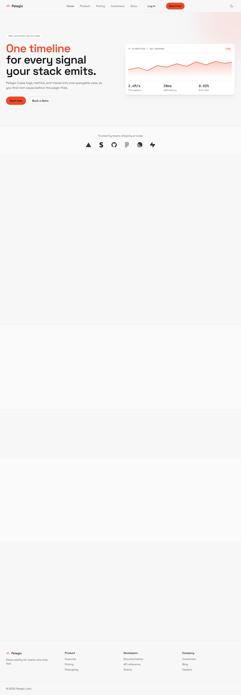
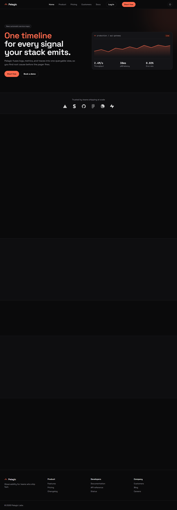
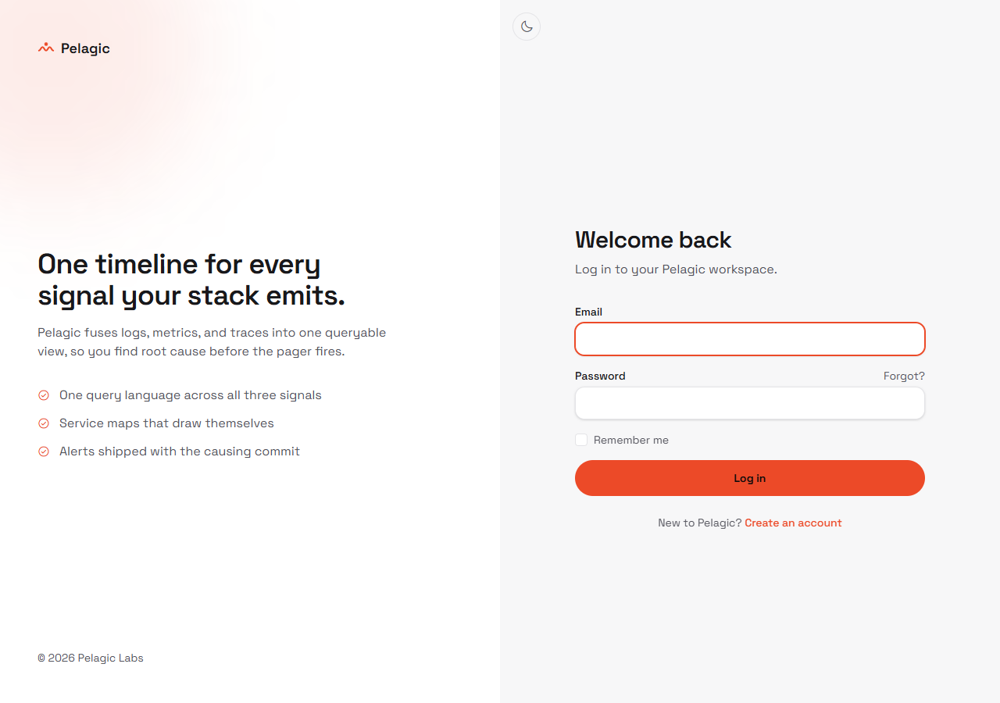
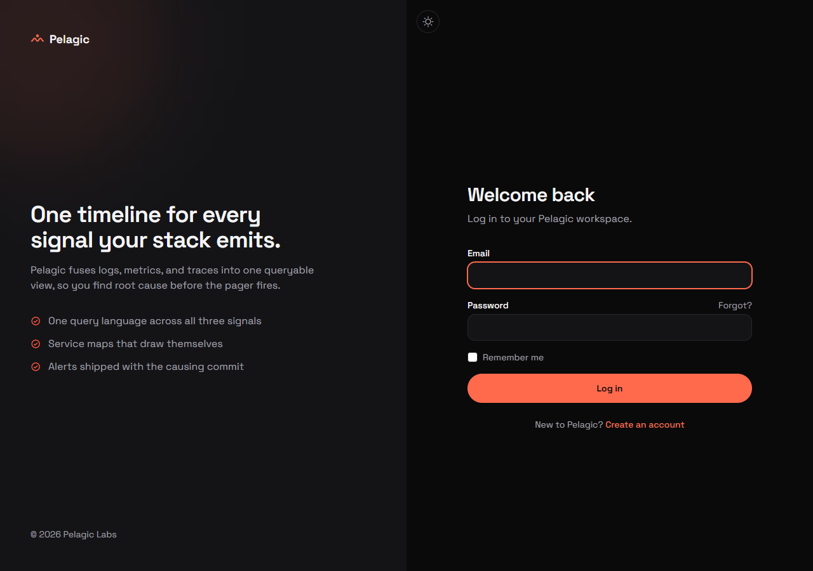
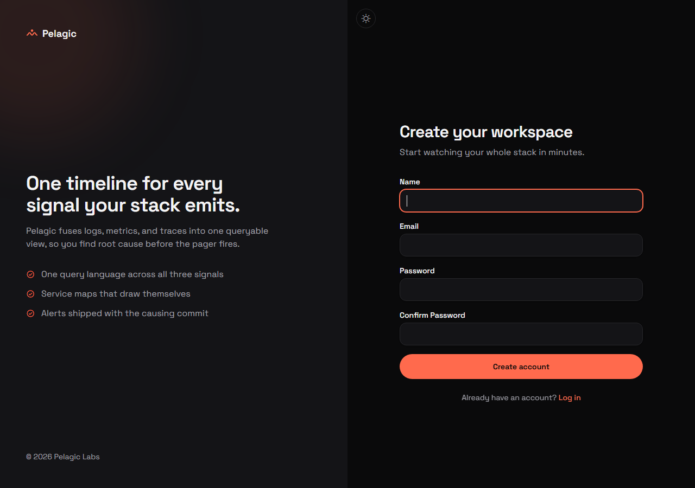
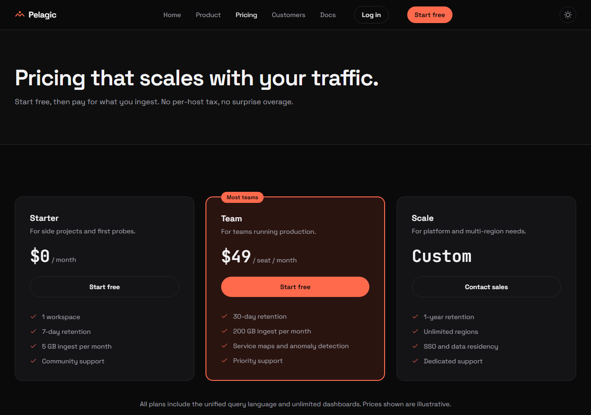
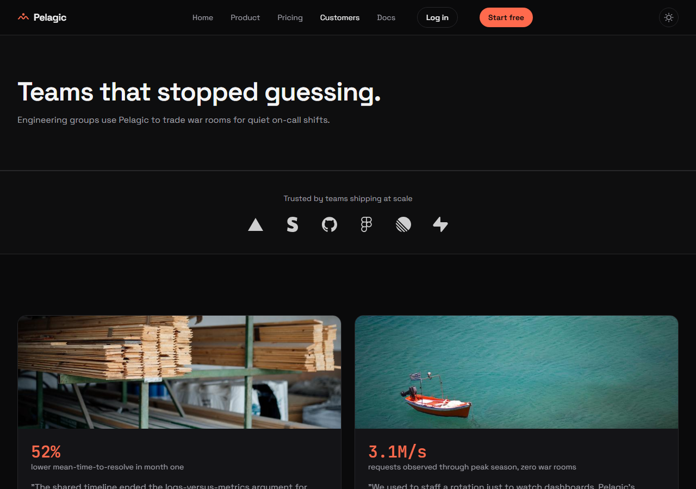
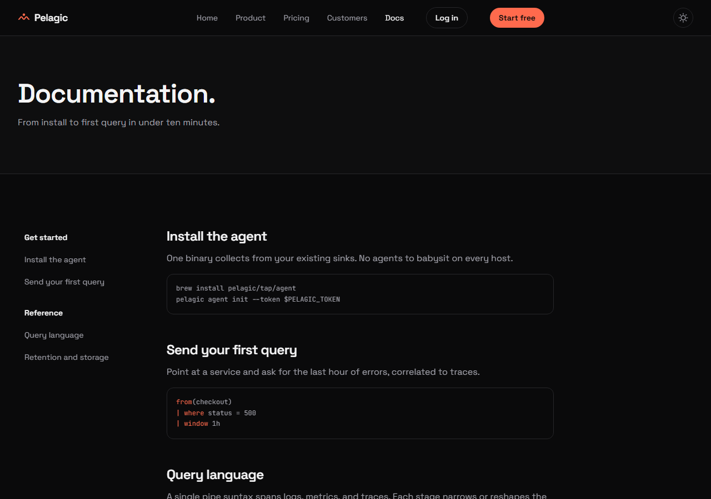
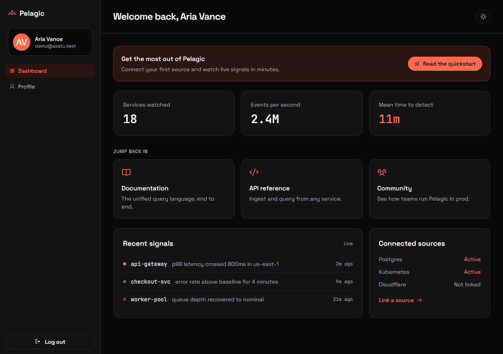
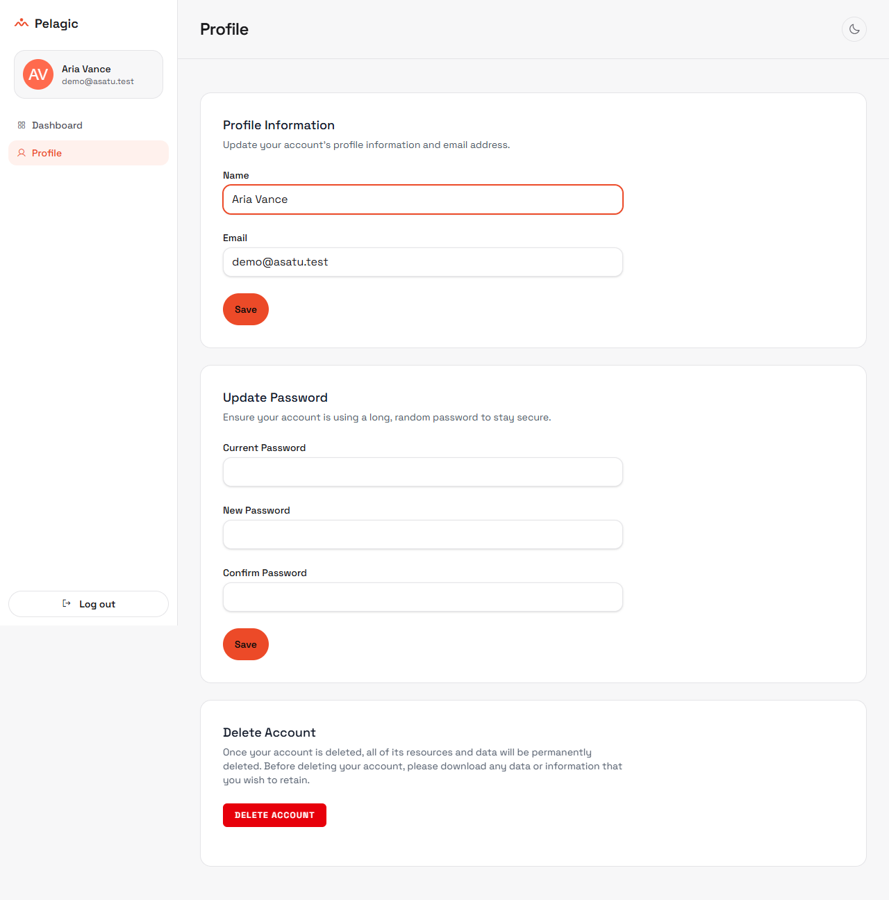

# Pelagic

A marketing site and authenticated dashboard for **Pelagic**, an observability product that fuses logs, metrics, and traces into one queryable timeline so teams find root cause before the pager fires.

## What it is

- **Public marketing site**: Home, Product, Pricing, Customers, and Documentation pages with a dark/light theme and responsive layout.
- **Authentication**: Login, registration, email verification, password reset, and profile management, built on Laravel Breeze (Volt + Livewire).
- **Authenticated app**: A coral-themed dashboard with a sidebar shell, stat cards, recent signals, connected sources, and quick links to the docs.

## Tech stack

- **Laravel 13** (PHP 8.3+) as the application framework.
- **Livewire 3 + Volt** for reactive, server-rendered UI components (no separate JavaScript SPA framework).
- **Laravel Breeze** (Volt stack) for the auth scaffolding.
- **Tailwind CSS v4** compiled through the `@tailwindcss/vite` plugin, bundled by **Vite 8**.
- **PostgreSQL** as the database (via `pdo_pgsql`).
- Self-hosted variable fonts (Space Grotesk, JetBrains Mono) and Phosphor Icons. No UI component library; the design system is hand-built CSS tokens in `resources/css/app.css`.

## Requirements

- PHP 8.3 or higher
- PostgreSQL
- Node.js and npm

## Installation

```bash
composer install
cp .env.example .env        # then set DB_CONNECTION=pgsql and your Postgres credentials
php artisan key:generate
php artisan migrate
npm install
npm run build
```

## Running locally

Use two separate terminals:

```bash
php artisan serve     # http://127.0.0.1:8000
npm run dev           # Vite dev server with hot reload
```

> On Windows, do **not** use `composer dev`. It launches `php artisan pail`, which needs the `pcntl` extension that PHP on Windows does not provide, and `concurrently --kill-others` then tears down the other processes. Running `php artisan serve` and `npm run dev` in separate terminals avoids this.

## Running the tests

Tests use an in-memory SQLite database and PHPUnit:

```bash
php artisan test
```

The suite covers the auth flows (registration, login, email verification, password reset/update, profile) and renders the authenticated dashboard and profile.

## Project layout

- `routes/web.php` and `routes/auth.php` define the public and authenticated routes.
- `resources/views/` holds the Blade and Volt components:
  - `layouts/marketing.blade.php` for public pages, `layouts/guest.blade.php` for auth screens, `layouts/app.blade.php` for the authenticated shell.
  - `livewire/pages/auth/*` for the auth Volt components.
  - `livewire/layout/navigation.blade.php` for the app sidebar.
  - `dashboard.blade.php` and `profile.blade.php` for the authenticated pages.
- `resources/css/app.css` is the design system (color tokens, dark mode, theme toggle, hover glow).
- `resources/js/app.js` wires the theme toggle, mobile nav, and scroll reveal, and re-applies them after Livewire navigation.

## Features

**Public site**
- **Home**: "One timeline for every signal your stack emits." Fuses logs, metrics, and traces into one queryable view.
- **Product**: a single pipe query language across all three signals, self-drawing service maps, and alerts shipped with the causing commit.
- **Pricing**: plans include the unified query language and unlimited dashboards (prices are illustrative).
- **Customers**: case studies (Holm Logistics, 52% lower mean-time-to-resolve; Northwind Retail, 3.1M events/s through peak with zero war rooms) and a pull quote from Cobalt Bank.
- **Docs**: install the agent, send your first query, the query language reference, and retention/storage notes.

**Authentication**
- Registration, login, email verification, password reset, and profile management (name, email, password, account deletion).
- "Remember me" sessions and password confirmation before sensitive actions.

**Authenticated app**
- Dashboard with stat cards (services watched, events per second, mean time to detect), a "Jump back in" link grid, recent signals, and connected sources.
- Sidebar shell with the user avatar, theme toggle, and logout.
- Persistent light/dark theme (stored in `localStorage`) and a hover glow on interactive controls.

## Screenshots

**Marketing home** (light and dark)




**Auth**





**Public pages**





**Authenticated app**





## Deployment

This is a standard Laravel app, so any PHP host with PostgreSQL works (Laravel Forge, Vapor, or a traditional server).

1. **Build front-end assets** for production:
   ```bash
   npm run build
   ```
   In production, `@vite` automatically serves the versioned files from `public/build`; no dev server is needed.

2. **Configure environment** (`.env`):
   - `APP_ENV=production`, `APP_DEBUG=false`, `APP_URL=https://your-domain`
   - `DB_CONNECTION=pgsql` plus database credentials
   - `MAIL_*` so password reset and verification emails actually send
   - `QUEUE_CONNECTION` / `SESSION_DRIVER` as desired (file, redis, or database)

3. **Run migrations on deploy**:
   ```bash
   php artisan migrate --force
   ```

4. **No special SPA server required.** Livewire `wire:navigate` works with ordinary Laravel routing, so the smooth in-app navigation needs no extra infrastructure.

Note: the theme is chosen client-side and persisted in `localStorage`, so it works without server configuration.

## License

This project is open-sourced under the MIT license.

enjoy the web and the vibe :D

NOTE: DO NOT USE YOUR REAL EMAIL!!! (this is a testing website)
